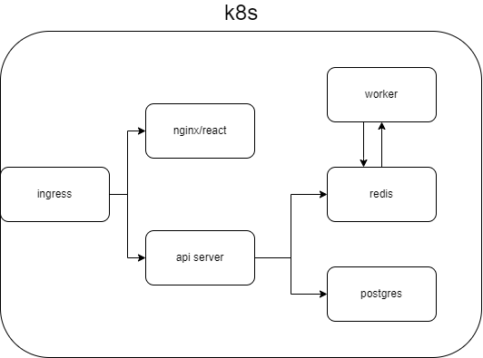

# k8s-fibonacci

Just a simple k8s cluster practice project.

## System design

## What I learned

- lots of basic concepts about k8s

- some [CD](./.github/workflows/cd.yml) stuffs

- how to get https certificate: [cert-manager](https://cert-manager.io/docs/)

- how to setup DNS

- plus: buy a domain :)
